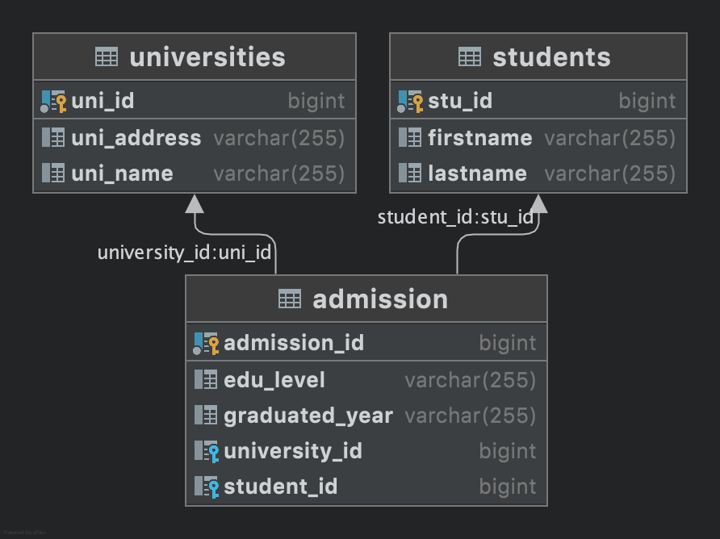

# University API

## setup project

* Run on port 8080
* Progress Database Port 5432

## ER Diagram

### Relationship

* universities have many student s' admission.
* students can enroll in many universities.
  

## Endpoints

### Student Endpoints

`GET /studentes` <br>

Return array of all students in database
<br>
Example response ( status code 200)

```json
[
  {
    "stuId": 1,
    "firstname": "John",
    "lastname": "Grey"
  },
  {
    "stuId": 2,
    "firstname": "Eric",
    "lastname": "Hank"
  },
  {
    "stuId": 3,
    "firstname": "Tom",
    "lastname": "Hank"
  }
]

```

`GET /students/{studentID}` <br>

Get student by studentId including admission information

If studentId does not exist, will throw exception studentNotFoundException (status 404)

Example response ( status code 200)

```json
{
  "studentId": 1,
  "firstname": "John",
  "lastname": "Grey",
  "admissionList": [
    {
      "admissionID": 1,
      "eduLevel": "BACHELOR_DEGREE",
      "graduatedYear": "2020",
      "uniId": 3,
      "universityName": "KMUTT"
    },
    {
      "admissionID": 2,
      "eduLevel": "MASTER_DEGREE",
      "graduatedYear": "2022",
      "uniId": 2,
      "universityName": "CU"
    },
    {
      "admissionID": 3,
      "eduLevel": "PHD",
      "graduatedYear": "2025",
      "uniId": 5,
      "universityName": "KU"
    }
  ]
}

```

`POST /students` <br>

Insert new student by Form-data

Key : stuForm <br>
Value :

```json
{
  "firstname": "Pin",
  "lastname": "Hank"
}
```

If sending inappropriate form, will return throw InvalidFormException (status 400)

Example response ( status code 201) return inserted data

```json
{
  "studentId": 5,
  "firstname": "Pin",
  "lastname": "Hank",
  "admissionList": []
}
```

`PUT \students\{studentId}` <br>

Edit firstname, lastname 's Student that has same id, by Form-data

If studentId does not exist, will throw StudentNotFoundException (status 404)

Key : stuForm

Value :

```json
{
  "firstname": "Pin",
  "lastname": "Thongyan"
}
```

If sending inappropriate form, will return throw InvalidFormException. (status 400)

Example response (status code 201) return edited data.

```json
{
  "studentId": 3,
  "firstname": "Pin",
  "lastname": "Thongyan",
  "admissionList": [
    {
      "admissionID": 6,
      "eduLevel": "BACHELOR_DEGREE",
      "graduatedYear": "2019",
      "uniId": 3,
      "universityName": "KMUTT"
    },
    {
      "admissionID": 7,
      "eduLevel": "MASTER_DEGREE",
      "graduatedYear": "2023",
      "uniId": 3,
      "universityName": "KMUTT"
    }
  ]
}
```

`DELETE /students/{studentId}`

delete student and admission information who has same studentId.

If studentId does not exist, will throw exception studentNotFoundException. (status 404)

return status code 204

### University Endpoints

`GET /universities`

Return array of all university in database.

Example response (status code 200)

```json
[
  {
    "uniId": 1,
    "uniName": "KKU",
    "uniAddress": "23 Moo 16 Mittraphap Rd., Nai-Muang, Muang District, Khon Kaen 40002"
  },
  {
    "uniId": 2,
    "uniName": "CU",
    "uniAddress": "254 Phayathai Rd, Wang Mai, Pathum Wan District, Bangkok 10330"
  },
  {
    "uniId": 3,
    "uniName": "KMUTT",
    "uniAddress": "126 Pracha Uthit Rd, Khwaeng Bang Mot, Khet Thung Khru, Krung Thep Maha Nakhon 10140"
  },
  {
    "uniId": 4,
    "uniName": "KMITL",
    "uniAddress": "1 Chalong Krung 1 Alley, Lat Krabang, Khet Lat Krabang, Krung Thep Maha Nakhon 10520"
  },
  {
    "uniId": 5,
    "uniName": "KU",
    "uniAddress": "50 Thanon Phahon Yothin, Khwaeng Lat Yao, Khet Chatuchak, Krung Thep Maha Nakhon 10900"
  }
]
```

`GET /universities/{uniId}`

Return university information that has same Id and student who enrolled.

If university Id does not exist, will throw exception universityNotFoundException. (status 404)

Example response (status code 200)

```json
{
  "uniId": 1,
  "uniName": "KKU",
  "uniAddress": "23 Moo 16 Mittraphap Rd., Nai-Muang, Muang District, Khon Kaen 40002",
  "studentList": [
    {
      "stuId": 2,
      "firstname": "Eric",
      "lastname": "Hank"
    }
  ]
}
```

`POST /universities`

Insert new university by Form-data

Key : uniForm

Value :

```json
{
  "uniName": "CMU",
  "uniAddress": "USA"
}
```

Example response (status code 201) return inserted data

```json
{
  "uniId": 6,
  "uniName": "CMU",
  "uniAddress": "USA",
  "studentList": []
}
```

`PUT /universities/{uniId}`

Edit name,address 's university which has same id

If university Id does not exist, will throw exception universityNotFoundException. (status 404)

Key : uniForm

Value :

```json
{
  "uniName": "CMU",
  "uniAddress": "TH"
}
```

Example Response (status code 201) return edited data

```json
{
  "uniId": 1,
  "uniName": "CMU",
  "uniAddress": "USA",
  "studentList": [
    {
      "stuId": 2,
      "firstname": "Eric",
      "lastname": "Hank"
    }
  ]
}
```

`DELETE /universities/{uniId}`

Delete university, admission information which has same Id.

If university Id does not exist, will throw exception universityNotFoundException. (status 404)

return status code 204
